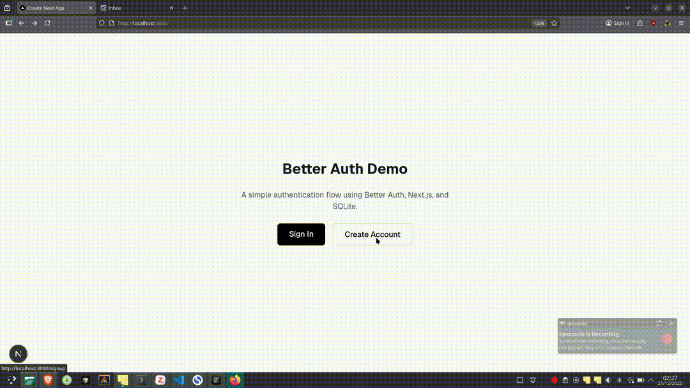

# Better Auth Demo

A complete authentication system built with Better Auth, Next.js, Drizzle ORM, and SQLite.

## Demo

Watch the complete authentication flow in action—signup, signin, session management, and protected routes.



## Features

- Email/Password authentication
- Session management with secure HttpOnly cookies
- Protected routes with Middleware (Server-side)
- Type-safe Authentication Client
- Sign up, sign in, and sign out flows

## Tech Stack

- [Next.js 15](https://nextjs.org/)
- [Better Auth](https://www.better-auth.com/)
- [Drizzle ORM](https://orm.drizzle.team/)
- [SQLite](https://www.sqlite.org/) (via `better-sqlite3`)
- [TypeScript](https://www.typescriptlang.org/)
- [Tailwind CSS](https://tailwindcss.com/)

## Getting Started

### Prerequisites

- Node.js 18+
- npm, yarn, pnpm, or bun

### Installation

1. **Clone the repository:**

```bash
git clone [https://github.com/your-username/your-repo.git](https://github.com/your-username/your-repo.git)
cd your-repo
```

2. **Install dependencies:**

```bash
npm install
```

3. **Set up the database:**

This will create your local SQLite database file based on the schema defined in `lib/auth-schema.ts`.

```bash
npx drizzle-kit push
```

4. **Run the development server:**

```bash
npm run dev
```

Open [http://localhost:3000](http://localhost:3000) to see the app.

## Project Structure

```
├── app/
│   ├── (auth)/            # Auth routes (signin/signup)
│   ├── dashboard/         # Protected dashboard page
│   ├── api/auth/[...all]/ # Better Auth API route
│   └── page.tsx           # Home page (checks session)
├── components/
│   ├── sign-in.tsx        # Sign in form component
│   └── sign-up.tsx        # Sign up form component
├── lib/
│   ├── auth.ts            # Server-side Auth config
│   ├── auth-client.ts     # Client-side Auth hook
│   ├── auth-schema.ts     # Database schema definition
│   └── db.ts              # Database connection
└── middleware.ts          # Route protection logic
```

## Usage

1. **Sign Up:** Visit `/signup` to create a new account.
2. **Check Session:** After redirecting, the Home page will verify your session and display your user details.
3. **Protected Route:** Try accessing `/dashboard`.
   - If logged in: You see the dashboard.
   - If logged out: The Middleware automatically redirects you to the Sign In page.
4. **Sign Out:** Click the sign-out button to clear the HttpOnly cookie and end the session.

## Learn More

- [Better Auth Documentation](https://www.better-auth.com/docs)
- [Next.js Documentation](https://nextjs.org/docs)
- [Drizzle ORM Documentation](https://orm.drizzle.team/docs/overview)
